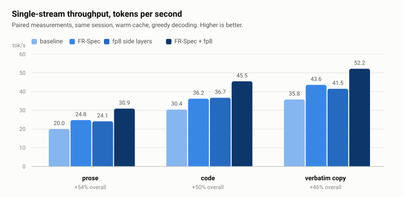
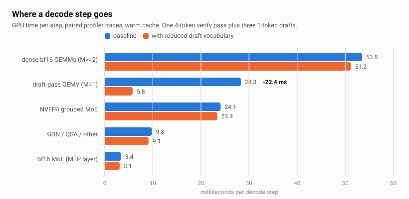
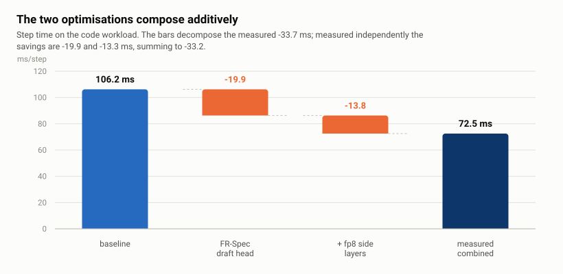
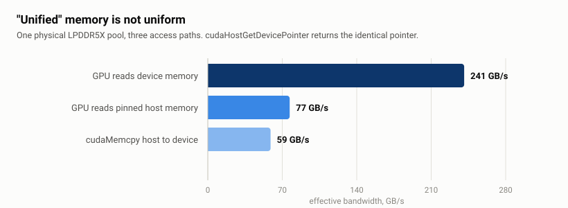
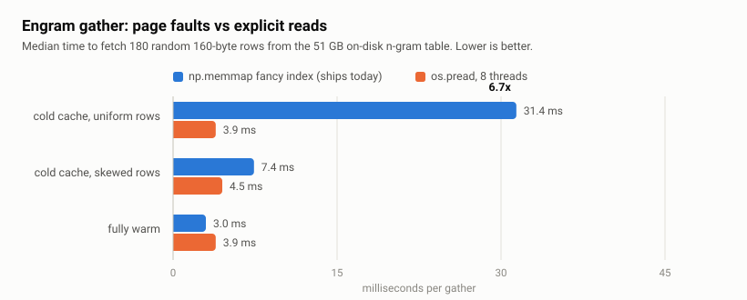

# Making a 176B MoE decode 50 % faster on one DGX Spark

A measurement study of single-stream decoding for **Qwen3.8-Flash-Next** — a 176B-parameter
hybrid linear-attention MoE with ~6B active parameters and a 51 GB n-gram ("engram") embedding
table served from NVMe — on a single **NVIDIA GB10** (DGX Spark class, sm_121, 121 GB unified
LPDDR5X, 20 Arm cores), under vLLM with the model's native MTP speculative decoding.

Two changes, both measured, take single-stream decoding from **30.4 to 45.5 tok/s** on code:

<picture>
  <source media="(prefers-color-scheme: dark)" srcset="docs/figures/throughput-dark.svg">
  
</picture>

| config | prose | code | verbatim copy | ms/step (code) |
|---|---:|---:|---:|---:|
| no speculation | 15.0 | 15.1 | 15.0 | 66.3 |
| **baseline** (MTP depth 3) | 20.0 | 30.4 | 35.8 | 106.2 |
| frequency-ranked draft head | 24.8 | 36.2 | 43.6 | 86.3 |
| fp8 side layers | 24.1 | 36.7 | 41.5 | 92.9 |
| **both** | **30.9** | **45.5** | **52.2** | **72.5** |
| | **+54.5 %** | **+49.7 %** | **+45.8 %** | **-31.7 %** |

---

## 1. A 6B-active model spends a quarter of every step re-reading its output head

Decode here is bandwidth-bound: GPU utilisation sits at 92-96 % and the achievable read
bandwidth is 241 GB/s, so the step time is essentially "bytes moved / bandwidth". The useful
question is therefore not *what is slow* but *what is read*.

Profiling says the answer is surprising. The model activates ~6B parameters per token, but its
MTP drafter **shares the target's 248,320 x 2560 bf16 output head — 1.27 GB** — and at
speculative depth 3, batch 1, that head is read **four times per step**: once for the verify
pass and once for each of the three drafts.

<picture>
  <source media="(prefers-color-scheme: dark)" srcset="docs/figures/step-anatomy-dark.svg">
  
</picture>

Every draft pass runs at M=1, so it lands in cuBLAS's GEMV path: 61 GEMV calls of ~8 ms each in
a 27-step trace, 501 of the 553 ms spent in GEMV. That is **28 ms of a 106 ms step**.

### The fix: restrict only the drafter's vocabulary

This is [FR-Spec](https://arxiv.org/abs/2502.14856) applied to a native MTP head. The drafter
proposes from the 32,768 most frequent tokens; the **target still verifies over the full
248,320-token vocabulary and rejection sampling is untouched**, so the output distribution is
unchanged by construction. Only the candidate set narrows.

The draft head becomes a 168 MB slice of `lm_head`. Coverage of a mixed corpus at K=32,768 is
99.8 % on code and 99.2 % on prose, and measured acceptance falls only 0.5-3.4 %:

| | baseline | FR-Spec 32K |
|---|---:|---:|
| draft-pass GEMV time | 28.3 ms/step | **5.8 ms/step** |
| GEMV calls > 4 ms per trace | 61 (501.6 ms) | 1 (9.1 ms) |
| tokens/step, code | 3.23 | 3.12 |
| throughput, code | 30.4 tok/s | **36.2 tok/s** |

**Why this is worth more here than in published results.** A prototype of the same idea on a
dense 27B model reported an 85 % cut in draft head kernel time but only **+1.4-3.1 %**
end-to-end. The difference is the head-to-body byte ratio: on a dense model the body dominates
and the head is a rounding error. The value of FR-Spec scales as

```
  vocabulary x hidden x (1 + draft depth)   /   active body bytes
```

which is large exactly for **sparse MoE models with big vocabularies and native
multi-token-prediction heads** — i.e. much of what people now run on single devices.

Implementation: [`patches/frspec_mtp.py`](patches/frspec_mtp.py) (~130 lines, no engine fork).

## 2. The two levers compose additively

The remaining bulk of the step is dense bf16 GEMMs. Converting the side layers that every token
reads in full — GDN in/out projections, sparse-attention q/k/v/o, shared experts — to blockwise
fp8-e4m3 removes another 13 ms.

<picture>
  <source media="(prefers-color-scheme: dark)" srcset="docs/figures/ablation-dark.svg">
  
</picture>

Measured alone the savings are -19.9 ms and -13.3 ms; measured together, **-33.7 ms** against a
sum of parts of -33.2 ms. **They add to within 1.5 %**, because they act on disjoint terms
(M=1 GEMV in the drafts, M>=2 GEMM in the verify) of a step whose cost is simply bytes moved.
That is the practical value of establishing the step is bandwidth-bound: remaining levers can
be evaluated independently and their gains summed.

A pleasant side effect: fp8 *raises* acceptance, from 3.23 to 3.41 tokens/step. Drafter and
target share the quantised layers, so the perturbation is common-mode and does not
desynchronise them.

## 3. "Unified" memory is not uniform

<picture>
  <source media="(prefers-color-scheme: dark)" srcset="docs/figures/bandwidth-dark.svg">
  
</picture>

One physical LPDDR5X pool, three access paths. `cudaHostGetDevicePointer` returns the
**identical pointer** — a single address space — and the GPU still reads host-allocated memory
at under a third of device-local speed. Any "it's unified, just put it in host memory" plan
pays a 3-4x bandwidth tax.

Related: cuBLAS reaches 205-230 GB/s (~96 % of roofline) at M>=2 but only 163-174 GB/s at M=1.
So **widening the verify batch makes the dense two-thirds of the model cheaper** — speculation
pays twice on this hardware, once in tokens per step and once in kernel efficiency.

## 4. The engram gather is a page-fault problem

The 51 GB n-gram table is memory-mapped from NVMe and gathered per step. The shipping
implementation uses `np.memmap` fancy indexing, inline and single-threaded for decode-sized
batches, so every non-resident row becomes a **serialized synchronous page fault**.

<picture>
  <source media="(prefers-color-scheme: dark)" srcset="docs/figures/engram-gather-dark.svg">
  
</picture>

Explicit `pread` on 8 threads is **6.7x faster on cold rows** and 0.9 ms slower when everything
is resident, so the right design is a hybrid: memmap for resident rows, batched `pread` for
misses. Notably the *transfer* half of the lookup is irrelevant — 25-32 us against 3-40 ms of
I/O — so a zero-copy GPU gather, which works and is correct, buys nothing.

## 5. Two confounds that make cross-time comparison meaningless

This is the part most likely to save someone else's afternoon. Re-running the **identical**
baseline hours later gave 106.2 ms/step against 87.7 ms earlier, with bit-identical acceptance
(greedy decoding is deterministic, so the model did exactly the same work).

1. **Engram page-cache warmth**, up to ~18 ms/step. The gather goes 11.6 -> 9.8 -> 5.9 -> 1.6 ->
   0.3 ms/op over roughly three passes of the benchmark suite.
2. **A logged-in desktop session**, ~21 %. Its GPU footprint is ~400 MB and a few percent
   utilisation, but compositing competes for the memory bandwidth decode is bound by.

A profiler trace taken on a cold cache shows the GPU *kernels themselves* ~30 % slower, because
NVMe reads filling the page cache steal bandwidth from the GPU.

Every number in this repo is therefore measured **back-to-back in one session, after the gather
stabilises, reporting the third pass**. See [METHOD.md](METHOD.md).

## Negative and blocked results

Reported because they cost real time:

- **`flashinfer_b12x`**, the SM120/SM121-specific fused MoE kernel, binds correctly to the
  NVFP4 experts and then kills the engine on the MTP layer's bf16 experts — `--moe-backend` is
  a single global setting. Needs a per-layer override or an NVFP4 draft layer.
- **Speculative depth 5** does not boot: `QSA ring capacity 12 must divide the attention block
  size 1616`. Only depths where the auto-chosen block size is a multiple of `2*(k+1)` work.
- **Naive fp8** (dequantise to bf16, then GEMM) is **4.5x slower** than staying in bf16. fp8
  pays only through a real fp8 GEMM path.
- **`O_DIRECT`** loses to buffered `pread` (7.3 vs 5.6 ms): a 160-byte row still forces a 4 KiB
  aligned read and gives up all caching.
- A silent-failure warning: the first FR-Spec implementation patched a sampling path that was
  never called, so the drafter emitted reduced-vocabulary *indices as token ids*. Output stayed
  correct — the target rejects them — and only acceptance collapsed, from 3.23 to 1.16. Any
  implementation of this needs an explicit mapped/unmapped counter.

## Layout

```
patches/frspec_mtp.py     frequency-ranked draft head (the main result)
patches/ple_pread.py      engram gather via threaded pread instead of page faults
scripts/bench_steps.py    step-level harness: reads the engine's own counters
scripts/exp.sh            isolated experiment launcher
scripts/token_freq.py     builds the frequency-ranked vocabulary
scripts/*_bench*.py       machine characterisation microbenchmarks
scripts/compare_traces.py paired profiler comparison, normalised per decode step
RESULTS.md                every number, with conditions
FINDINGS.md               the full measurement log in order
METHOD.md                 the benchmarking protocol and why it is mandatory
```

## Status and caveats

This is a measurement study from one machine, not a library. The FR-Spec patch is
output-preserving and I would run it in production; the fp8 side layers change numerics (worst
per-tensor max relative error 0.0354) and still owe a formal quality evaluation — top-1
agreement against bf16, verbatim recall, long-context needle tests — before I would recommend
them. The patches are monkey-patches against one vLLM build, meant to be readable and to make
the effect measurable, not to be a merge-ready contribution.

See [NOTICE.md](NOTICE.md) for the upstream work this builds on, without which none of it would
have run at all.
